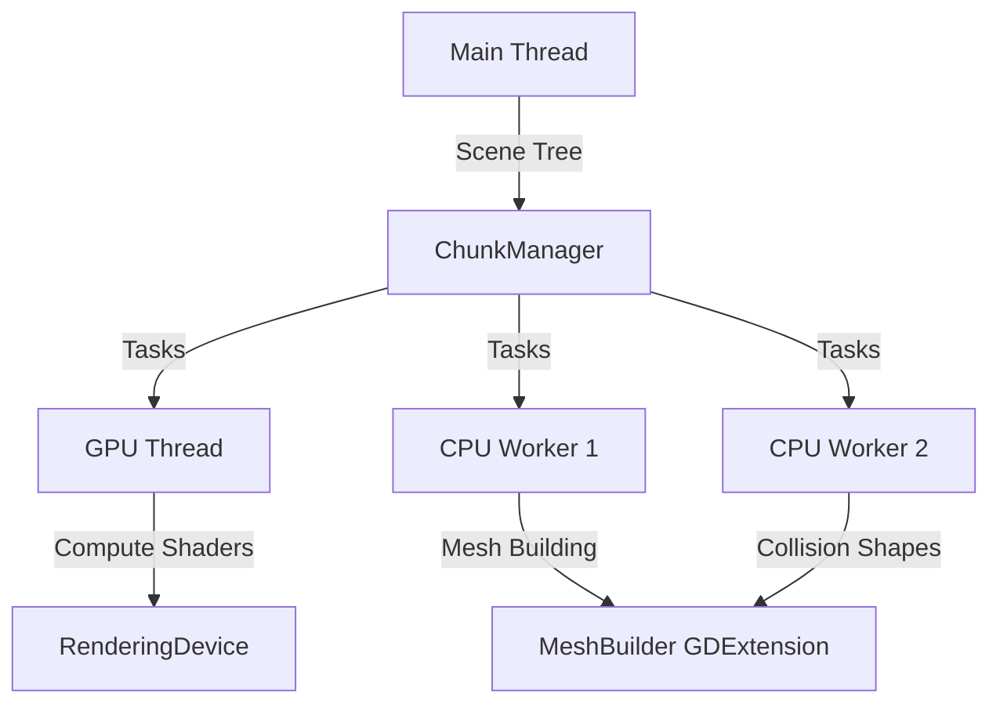

# System Architecture Reference

**Purpose**: Technical reference for the current Marching Cubes terrain implementation.

---

## Core Constants

| Constant | Value | Purpose |
|:---------|:------|:--------|
| `CHUNK_SIZE` | 32 | Voxels per chunk axis |
| `CHUNK_STRIDE` | 31 | World-space distance between chunk origins (overlap by 1) |
| `DENSITY_GRID_SIZE` | 33 | Grid points per axis (0..32, provides 1-voxel overlap) |
| `MIN_Y_LAYER` | -20 | Minimum vertical chunk layer |
| `MAX_Y_LAYER` | 40 | Maximum vertical chunk layer |
| `ISO_LEVEL` | 0.0 | Marching Cubes isosurface threshold |

---

## 1. Orchestration Layer

### ChunkManager (`chunk_manager.gd`)

**Size**: 2240 lines, 111 functions  
**Role**: Central coordinator for terrain generation, modification, and lifecycle management.

#### Threading Model



- **Main Thread**: Lifecycle management, scene tree integration, visibility updates
- **GPU Thread**: Single dedicated thread for `RenderingDevice` orchestration
  - Uses **interruptible delays** (10ms polling) to prioritize player edits over background loading
- **CPU Worker Pool**: 2 threads for native C++ work (`MeshBuilder` operations)

#### Chunk Lifecycle

1. **Generation**: `gen_density.glsl` → `gen_water_density.glsl` → GPU density buffers
2. **Meshing**: `marching_cubes.glsl` → GPU vertex buffer → CPU `MeshBuilder`
3. **Finalization**: Time-distributed node creation (100ms intervals) to prevent visual pops
4. **Unloading**: Chunks outside render distance are freed, modifications persist in `stored_modifications`

#### Column Protection Rule

Chunks between `Y=-20` and `Y=1` are **never unloaded** while within horizontal range, ensuring vertical collision stability for underground structures.

#### Adaptive Loading

- **Target FPS**: 75.0
- **Min Acceptable FPS**: 45.0
- **Frame Budget**: Dynamically adjusted (0.25ms to 1.5ms) based on 30-sample rolling FPS average
- **Loading Pause**: Triggered when FPS drops below 45

#### Two-Phase Loading

| Phase | Trigger | Delay | Purpose |
|:------|:--------|:------|:--------|
| **Initial Load** | Game start | 0-100ms | Fast loading for initial ~π×r² chunks |
| **Exploration** | After initial target met | 100-300ms | Throttled loading during gameplay |

---

## 2. Generation Pipeline

### Density Generation (`gen_density.glsl`)

**Grid**: 33×33×33 points (covers 32×32×32 voxels + 1-voxel overlap)  
**Dispatch**: `local_size_x/y/z = 4` (64 threads per workgroup)

#### Biome Distribution

Uses **2D fbm noise** (3 octaves) for horizontal biome distribution:

```glsl
float biome_val = fbm(world_pos.xz * 0.002);

if (biome_val < -0.2) → Sand
if (biome_val > 0.6)  → Snow
if (biome_val > 0.2)  → Gravel
else                  → Grass (default)
```

#### Procedural Road Network

- **Grid-based**: Roads run along cell edges at `procedural_road_spacing` intervals (default: 100m)
- **Height Following**: Roads follow terrain with gentle variation (3.0 Y-levels max difference)
- **Stepped Surface**: 45% flat zones at integer Y-levels, 10% smooth ramps between
- **Material ID**: 6 (Asphalt)

#### Underground Variation

- **3D fbm noise** for cave-like structures and ore deposits
- **Ore Veins**: `noise(world_pos * 0.15) > 0.75` at depth > 8.0
- **Granite Deposits**: `fbm3d(world_pos * 0.02) > 0.25` (~35-40% of underground)

### Water Generation (`gen_water_density.glsl`)

**Separate isosurface** for volumetric water mesh:

```glsl
density = water_level - world_pos.y
```

Simple flat plane at `water_level = 13.0`, intersects terrain naturally via Z-buffer.

---

## 3. Terrain Interaction

### Modification System (`modify_density.glsl`)

**Rate Limiting**: 100ms cooldown (max 10 modifications/second) to prevent GPU overload.

#### Brush Shapes

| Shape | Type | Distance Function | Use Case |
|:------|:-----|:------------------|:---------|
| **Sphere** | 0 | `length(pos - brush_pos)` | Smooth organic digging/placing |
| **Box** | 1 | `max(abs(dx), abs(dy), abs(dz))` | Hard-edged cubic modifications |
| **Column** | 2 | `abs(dx) <= 0.5 && abs(dz) <= 0.5` | Precise 1×1 vertical fills |
| **Diamond** | 3 | `abs(dx) + abs(dy) + abs(dz)` | 45-degree slopes (Manhattan distance) |

#### Material System

- **Material IDs**: Stored in separate `material_buffer` (uint per voxel)
- **Placement Logic**: Material written when `brush_value < 0` (adding solid)
- **Digging Logic**: Materials NOT reset (reveals existing underground materials)
- **Density Clamping**: `clamp(density, -10.0, 10.0)` prevents extreme gradients

#### Persistence

`stored_modifications` dictionary persists all player edits across chunk unloads:

```gdscript
{
  Vector3i(chunk_coord): [
    { brush_pos, radius, value, shape, layer, material_id },
    ...
  ]
}
```

---

## 4. Meshing & Rendering

### GPU Mesher (`marching_cubes.glsl`)

**Dispatch**: `local_size_x/y/z = 8` (512 threads per workgroup)  
**Algorithm**: Classic Marching Cubes with lookup tables

#### Lookup Tables

Currently **hardcoded** in `marching_cubes_lookup_table.glslinc` (17KB) for driver compatibility. Future: migrate to storage buffers.

#### Vertex Format

**Stride**: 9 floats per vertex

```
[Position (3)] [Normal (3)] [Material Color (3)]
```

- **Position**: Local chunk coordinates (0-32)
- **Normal**: Calculated from density gradient
- **Material Color**: `(mat_id/255.0, 1.0, 0.0)` - ID encoded in R channel

### GDExtension Layer (`mesh_builder.cpp`)

**Performance Optimization**: Direct memory casting bypasses `SurfaceTool` overhead (10× faster).

```cpp
// Direct cast from float* to Vector3*
v_ptr[i] = *reinterpret_cast<const Vector3*>(&src[idx]);
n_ptr[i] = *reinterpret_cast<const Vector3*>(&src[idx + 3]);
```

#### Native Height Masking

Sub-voxel linear interpolation for precise vegetation placement, preventing "snapping" to world steps.

### Terrain Shader (`terrain.gdshader`)

#### Tri-Planar Mapping

Seamless texturing on all faces using world-space normals:

```glsl
vec3 weights = abs(normalize(world_normal));
weights = max(weights - 0.2, 0.0);
weights /= dot(weights, vec3(1.0));
```

#### Material Blending

- **Surface Biomes**: Per-pixel fbm blending (Grass/Sand/Gravel/Snow)
- **Underground**: Direct material ID lookup (Stone/Ore/Granite)
- **Player-Placed**: Material ID >= 100, overrides procedural generation

#### Cliff Rock Enhancement

Slope-based visual overlay (`slope < 0.7`) applied only above `surface_cliff_threshold = 10.0` to preserve underground material visibility.

### Water Shader (`water.gdshader`)

**Volumetric Transparency**: Beer's Law depth-based fading  
**Color Mixing**: Shallow (green) to Deep (dark teal) based on depth  
**Normal Forcing**: `vec3(0, 1, 0)` to eliminate "jelly" meniscus at shoreline

---

## 5. Material ID Reference

| ID | Material | Context |
|:---|:---------|:--------|
| 0 | Grass | Default surface |
| 1 | Stone | Underground base |
| 2 | Ore | Rare, deep veins |
| 3 | Sand | Beach biome |
| 4 | Gravel | Rocky biome |
| 5 | Snow | Arctic biome |
| 6 | Road | Asphalt (procedural) |
| 9 | Granite | Underground variant |
| 100+ | Player-Placed | Base ID + 100 |

---

## 6. Performance Characteristics

### Time Budgets

- **Chunk Update**: < 2ms (monitored by `PerformanceMonitor`)
- **Node Finalization**: < 2ms per chunk
- **Adaptive Frame Budget**: 0.25ms - 1.5ms (FPS-dependent)

### Collision Optimization

- **Collision Distance**: 3 chunks (cheaper than render distance)
- **Proximity Updates**: Every 30 frames
- **Vertical Range**: ±2 Y layers from player

### Memory Management

- **CPU Density Mirrors**: `PackedFloat32Array` for physics queries
- **Material Texture**: 3D `ImageTexture3D` (R8 format) for fragment shader sampling
- **Modification Batching**: Synchronized updates via `modification_batch_id`

---

## 7. Known Limitations

> [!NOTE]
> **Additive Density**: Current system uses `density += modification`, creating "density memory" where overlapping brushes accumulate. This makes precise surface placement unpredictable.

> [!NOTE]
> **Chunk Stride Overlap**: `CHUNK_STRIDE = CHUNK_SIZE - 1` creates physical 1-unit overlap between chunks. This prevents gaps but causes z-fighting on transparent meshes (water).

> [!NOTE]
> **Hardcoded Lookup Tables**: 17KB lookup tables embedded in shader code. Some drivers fail compilation (`vkCreateComputePipelines error -13`). Migration to storage buffers planned.

---

## Cross-References

- Design Vision → [02_design_vision.md](file:///C:/Users/Windows10_new/Documents/gpu-marching-cubes/world_marching_cubes/technical_documents/02_design_vision.md)
- Migration Roadmap → [03_migration_roadmap.md](file:///C:/Users/Windows10_new/Documents/gpu-marching-cubes/world_marching_cubes/technical_documents/03_migration_roadmap.md)
