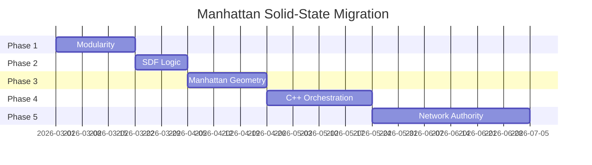

# Migration Roadmap: Transition to Manhattan Solid-State

**Purpose**: Practical transition plan from current additive density system to future command-driven Manhattan architecture.

---

## Migration Principles

> [!IMPORTANT]
> All migrations must preserve existing player saves and avoid breaking changes where possible. Use **versioning** and **compatibility layers** to enable gradual adoption.

---

## Phase 1: Modularity (Foundation)

**Goal**: Extract configuration and modification logic from `ChunkManager` monolith.

**Duration**: 2-3 weeks  
**Breaking Changes**: None

### Step 1.1: Extract `TerrainConfig`

Create `terrain_config.gd` autoload:

```gdscript
# terrain_config.gd
extends Node

const CHUNK_SIZE = 32
const CHUNK_STRIDE = 31
const DENSITY_GRID_SIZE = 33
const MIN_Y_LAYER = -20
const MAX_Y_LAYER = 40
const ISO_LEVEL = 0.0

@export var terrain_height: float = 10.0
@export var noise_frequency: float = 0.1
@export var water_level: float = 13.0
# ... all configuration parameters
```

**Benefit**: Single source of truth for constants, easier to modify and test.

### Step 1.2: Extract `TerrainModifier`

Create `terrain_modifier.gd`:

```gdscript
# terrain_modifier.gd
class_name TerrainModifier

static func calculate_affected_chunks(pos: Vector3, radius: float) -> Array[Vector3i]:
    # Logic for determining which chunks are affected by modification
    pass

static func create_modification_task(coord: Vector3i, brush_params: Dictionary) -> Dictionary:
    # Logic for creating GPU task from brush parameters
    pass
```

**Benefit**: Modification logic becomes testable and reusable.

### Step 1.3: Move `active_chunks` to `TerrainGrid`

Migrate chunk tracking from GDScript `Dictionary` to native C++ `std::unordered_map`:

```cpp
// terrain_grid.h
class TerrainGrid {
    std::unordered_map<Vector3i, ChunkData*> active_chunks;
    
    void add_chunk(Vector3i coord, ChunkData* data);
    ChunkData* get_chunk(Vector3i coord);
    std::vector<Vector3i> get_chunks_in_radius(Vector3 center, float radius);
};
```

**Benefit**: **SIMD-optimized distance checks** for faster chunk queries.

### Step 1.4: Reduce `ChunkManager` to Orchestrator

After extraction, `ChunkManager` becomes a pure signal router:
- Receives player input
- Delegates to `TerrainConfig`, `TerrainModifier`, `TerrainGrid`
- Manages threading and GPU communication

**Result**: Clean separation of concerns, easier to understand and maintain.

---

## Phase 2: SDF Logic (Precision)

**Goal**: Implement CSG-style SDF composition for precise, non-blobby builds.

**Duration**: 1-2 weeks  
**Breaking Changes**: Requires save migration

### Step 2.1: Implement Voxel Version Header

Add version field to chunk save data:

```gdscript
# Save format:
{
  "version": 2,  # V1 = Additive, V2 = SDF
  "modifications": [...]
}
```

**Compatibility**:
- V1 chunks use `density += modification` (legacy)
- V2 chunks use `density = min/max(density, sdf)` (new)
- New modifications to V1 chunks trigger conversion to V2

### Step 2.2: Update `modify_density.glsl`

```glsl
layout(push_constant) uniform PushConstants {
    // ... existing fields
    int composition_mode;  // 0 = Additive (legacy), 1 = SDF Union, 2 = SDF Subtraction
} params;

void main() {
    // ... calculate brush_sdf
    
    if (params.composition_mode == 0) {
        // Legacy additive
        density_buffer.values[index] += modification;
    } else if (params.composition_mode == 1) {
        // SDF Union (Placing)
        density_buffer.values[index] = min(density_buffer.values[index], brush_sdf);
    } else {
        // SDF Subtraction (Digging)
        density_buffer.values[index] = max(density_buffer.values[index], -brush_sdf);
    }
}
```

### Step 2.3: Test and Validate

- Create test scenes with V1 and V2 chunks side-by-side
- Verify identical visual results for simple cases
- Confirm precision improvements for overlapping brushes

**Result**: Precise, non-blobby builds with backward compatibility.

---

## Phase 3: Manhattan Geometry (Crystalline World)

**Goal**: Make Octahedron the primary placement tool and introduce geometric space property.

**Duration**: 2-3 weeks  
**Breaking Changes**: Visual changes to new terrain (existing saves unaffected)

### Step 3.1: Introduce `VoxelBrush` Resource

```gdscript
# voxel_brush.res
class_name VoxelBrush extends Resource

enum GeometricSpace { EUCLIDEAN, MANHATTAN }
enum Shape { SPHERE, BOX, COLUMN, OCTAHEDRON }

@export var shape: Shape = Shape.OCTAHEDRON
@export var geometric_space: GeometricSpace = GeometricSpace.MANHATTAN
@export var radius: float = 3.0
@export var material_id: int = 1
@export var hardness: float = 10.0  # Gradient steepness
```

### Step 3.2: Update `modify_density.glsl` for Manhattan

```glsl
float calculate_distance(vec3 pos, vec3 center, int geometric_space) {
    if (geometric_space == 0) {
        // Euclidean
        return length(pos - center);
    } else {
        // Manhattan
        vec3 d = abs(pos - center);
        return d.x + d.y + d.z;
    }
}
```

### Step 3.3: Create Octahedron Presets

```gdscript
# Default placement tool
var octahedron_brush = VoxelBrush.new()
octahedron_brush.shape = VoxelBrush.Shape.OCTAHEDRON
octahedron_brush.geometric_space = VoxelBrush.GeometricSpace.MANHATTAN
octahedron_brush.hardness = 15.0  # Sharp edges
```

### Step 3.4: Gradual Biome Transition

Refactor procedural generation to use Manhattan space:

```glsl
// gen_density.glsl
// OLD: Euclidean noise
float hill_height = noise(vec3(world_pos.x, 0.0, world_pos.z) * params.noise_freq);

// NEW: Manhattan-influenced noise (optional, for crystalline landscapes)
float manhattan_influence = 0.5;
float euclidean_noise = noise(vec3(world_pos.x, 0.0, world_pos.z) * params.noise_freq);
float manhattan_noise = noise_manhattan(world_pos.xz * params.noise_freq);
float hill_height = mix(euclidean_noise, manhattan_noise, manhattan_influence);
```

**Result**: Crystalline, structured world with 45-degree slopes as standard.

---

## Phase 4: C++ Orchestration (Performance at Scale)

**Goal**: Move chunk lifecycle and distance checks to native code for massive performance gains.

**Duration**: 3-4 weeks  
**Breaking Changes**: None (internal optimization)

### Step 4.1: Native Chunk Lifecycle

Migrate `ChunkManager` logic to C++:

```cpp
// chunk_orchestrator.cpp
class ChunkOrchestrator {
    std::vector<ChunkData> chunks;
    
    // SIMD-optimized distance check (4 chunks at once)
    void update_visibility(Vector3 viewer_pos, float render_distance);
    
    // Multi-threaded chunk generation
    void generate_chunks_async(std::vector<Vector3i> coords);
};
```

**Benefit**: **10-100× faster** chunk queries and lifecycle management.

### Step 4.2: Binary SSBO Lookup Tables

Move hardcoded lookup tables to GPU storage buffers:

```cpp
// At initialization:
RID edge_table_buffer = create_storage_buffer(edgeTable, sizeof(edgeTable));
RID tri_table_buffer = create_storage_buffer(triTable, sizeof(triTable));

// In shader:
layout(set = 1, binding = 0, std430) readonly buffer EdgeTable {
    int values[];
} edge_table;
```

**Benefit**: Eliminates shader compilation errors on some drivers, enables runtime optimization.

### Step 4.3: Multi-Isosurface Dithering

Generate separate LODs or variations (Water vs Terrain) with unified native manager:

```cpp
struct IsosurfaceLayer {
    float iso_level;
    RID density_buffer;
    Material* material;
};

void generate_multi_isosurface(ChunkData* chunk, std::vector<IsosurfaceLayer> layers);
```

**Benefit**: Eliminates `CHUNK_STRIDE` physical overlap, replaces with mathematical continuity.

**Result**: Massive view distances, smooth 60+ FPS with hundreds of active chunks.

---

## Phase 5: Network Authority (Multiplayer Ready)

**Goal**: Enable dedicated server support and fluid multiplayer exploration.

**Duration**: 4-6 weeks  
**Breaking Changes**: Requires server infrastructure

### Step 5.1: Command-Delta Protocol

```gdscript
# Server broadcasts:
{
  "type": "terrain_modify",
  "command": "PlaceOctahedron",
  "pos": Vector3(100, 10, 50),
  "radius": 5.0,
  "material": 1,
  "timestamp": 12345
}

# Clients execute locally:
terrain_modifier.execute_command(command_data)
```

### Step 5.2: Headless Server Validation

Implement CPU fallback for Manhattan SDF:

```cpp
// terrain_validator.cpp (runs on headless server)
class TerrainValidator {
    // CPU-only Manhattan SDF evaluation
    float evaluate_density(Vector3 pos);
    
    // Collision detection without GPU
    bool is_position_solid(Vector3 pos);
    
    // Validate player movement
    bool can_move_to(Vector3 from, Vector3 to);
};
```

### Step 5.3: Deterministic Generation

Ensure 100% determinism:
- Seed-based noise functions
- Grid-locked Manhattan primitives
- Identical command execution order

**Benefit**: Prevents "mesh-desync" errors across clients.

### Step 5.4: Client-Side Prediction

```gdscript
# Apply command immediately (0-latency feedback)
terrain_modifier.execute_command(command, predicted=true)

# Server confirms or corrects
func on_server_response(command_id, accepted):
    if not accepted:
        terrain_modifier.rollback_command(command_id)
```

**Result**: Smooth multiplayer with authoritative server validation.

---

## Migration Timeline



**Total Duration**: ~18 weeks (~4.5 months)

---

## Compatibility Strategy

### Save Migration

```gdscript
func load_chunk_data(file_path: String) -> Dictionary:
    var data = load_json(file_path)
    
    if not data.has("version"):
        # Legacy V0 format
        return migrate_v0_to_v2(data)
    elif data.version == 1:
        # Additive density
        return migrate_v1_to_v2(data)
    else:
        # Current format
        return data
```

### Geometric Space Wrapper

```gdscript
# Existing brushes stay Euclidean
var legacy_sphere = VoxelBrush.new()
legacy_sphere.geometric_space = VoxelBrush.GeometricSpace.EUCLIDEAN

# New "Solid State" brushes default to Manhattan
var solid_octahedron = VoxelBrush.new()
solid_octahedron.geometric_space = VoxelBrush.GeometricSpace.MANHATTAN
```

### Gradual Rollout

- **Phase 1-2**: Internal refactoring, no user-facing changes
- **Phase 3**: Opt-in Manhattan tools, existing tools unchanged
- **Phase 4**: Performance improvements, invisible to users
- **Phase 5**: Multiplayer features, optional for single-player users

---

## Success Metrics

| Phase | Metric | Target |
|:------|:-------|:-------|
| P1 | Code complexity (lines in ChunkManager) | < 1000 lines |
| P2 | Placement precision (overlapping brushes) | ±0.1 voxel |
| P3 | Player satisfaction (45° slopes) | > 80% positive feedback |
| P4 | Render distance | 10+ chunks (vs 5 current) |
| P5 | Network bandwidth (per modification) | < 100 bytes |

---

## Rollback Plan

Each phase includes rollback capability:

```gdscript
# Feature flags for gradual rollout
const ENABLE_SDF_COMPOSITION = true
const ENABLE_MANHATTAN_GEOMETRY = false
const ENABLE_NATIVE_ORCHESTRATION = false

# Easy rollback if issues arise
if not ENABLE_SDF_COMPOSITION:
    use_legacy_additive_density()
```

---

## Cross-References

- Current Implementation → [01_system_architecture.md](file:///C:/Users/Windows10_new/Documents/gpu-marching-cubes/world_marching_cubes/technical_documents/01_system_architecture.md)
- Design Vision → [02_design_vision.md](file:///C:/Users/Windows10_new/Documents/gpu-marching-cubes/world_marching_cubes/technical_documents/02_design_vision.md)
